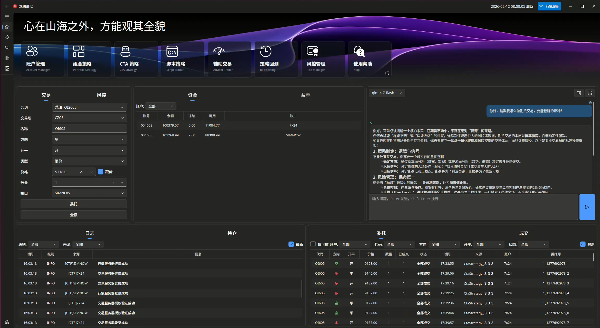
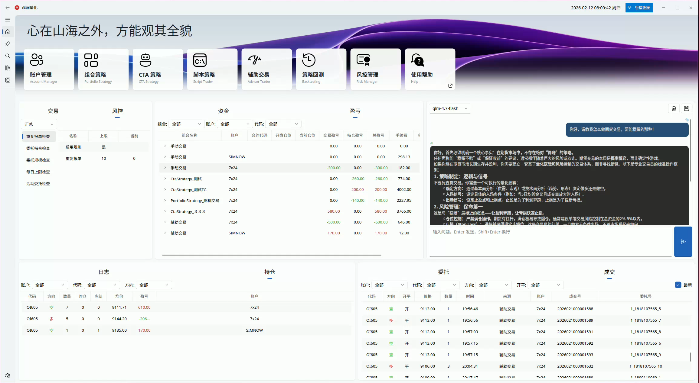

# 观澜量化 (Guanlan Quant)

> 心在山海之外，方能观其全貌

基于 [VNPY 4.3](https://www.vnpy.com/) 定制的中国期货量化交易桌面平台。专注于**个性化的操作体验**与**策略执行效果的直观呈现**，在策略架构、交易流程和日常运维等方面做了诸多修改。

采用 PySide6 + [QFluentWidgets](https://github.com/zhiyiYo/PyQt-Fluent-Widgets) 构建现代化 Fluent Design 界面。

---

## 截图

### 首页总览

首页集成所有核心监控面板：日志、持仓、委托、成交、资金、盈亏、风控、AI 助手，TAB 页切换，标题栏显示时钟与连接状态。





### CTA 策略管理

策略卡片展示 Params 参数、State 状态和 Vars 信号输出，支持一键初始化/启动/停止，运行状态实时更新。


### 辅助交易窗口

信号仪表盘展示方向和强度，策略输出控制开仓按钮启用/禁用，盘口分析、Tick 图表、交易统计一体化。


### 组合策略

多品种组合策略管理，支持跨品种对冲和套利交易。


### 脚本策略

多实例并行执行，灵活的脚本化交易。


### 多账户与设置

多 CTP 账户管理，支持实盘/模拟/7×24 环境并存，账户增删改查与自动登录配置。


### 合约管理

合约查询、收藏管理、主力合约自动识别与刷新。


### 实时行情图表

独立图表窗口，支持自定义多周期切换，内置 MA、MACD、RSI、海龟通道、KDJ 等指标插件，自动标记交易信号，集成 AI 智能分析。


---

## 相比原版 VNPY 的核心改进

### CTA 策略架构升级

原版 VNPY 的策略参数是扁平的 `parameters` / `variables` 列表，全英文变量名，无类型约束。观澜引入 **Pydantic BaseModel** 将策略数据分为三层：

**Params（策略参数）** — 用户可调参数，持久化保存，重启后恢复：

```python
class Params(BaseParams):
    fast_window: int = Field(default=10, title="快线周期", ge=2, le=200)
    slow_window: int = Field(default=20, title="慢线周期", ge=2, le=500)
    use_filter: str = Field(default="是", title="启用过滤", examples=["是", "否"])
```

**State（运行状态）** — 策略运行时产生的状态数据，持久化保存，重启后恢复：

```python
class State(BaseState):
    fast_ma: float = Field(default=0.0, title="快线值")
    slow_ma: float = Field(default=0.0, title="慢线值")
    # pos（持仓）由基类提供
```

**Vars（临时变量）** — 向 UI 输出实时信息，仅展示不持久化，辅助交易模式必用：

```python
class Vars(BaseVars):
    # 基类已提供：direction（方向）、strength（信号强度）、
    # tip（交易提示）、suggest_price（建议价格）、
    # allow_open_long（允许开多）、allow_open_short（允许开空）等
```

- **类型安全**：`validate_assignment=True`，赋值时自动校验，支持最大/最小值约束、下拉选项
- **中文界面友好**：`title` 字段自动显示中文标题，UI 根据字段类型生成对应控件（SpinBox、ComboBox 等）
- **策略中文名称**：自动提取策略类 docstring 首行作为中文显示名，策略选择下拉框显示 `MACD 金叉死叉策略` 而非 `MacdStrategy`，无需额外配置

### 一套策略，两种用法 — 自动交易与辅助交易

同一个策略代码，既可以在 CTA 引擎中**全自动交易**，也可以在辅助交易窗口中**半自动交易**：

- **全自动模式**：策略在 CTA 引擎中运行，自动开平仓，无需人工干预
- **辅助交易模式**：策略只负责计算信号，通过 `Vars` 向窗口输出方向、强度、建议价格等信息，**交易按钮由信号许可控制**，人工确认后才真正下单

辅助交易窗口会实时展示策略输出的信号：

```
策略计算 → Vars（方向/强度/提示/建议价/允许开多/允许开空）→ 信号卡片展示 → 按钮启用/禁用 → 人工点击下单
```

- 信号仪表盘实时显示多空方向和强度，边框颜色随信号动态变化
- 策略输出 `allow_open_long=True` 时买多按钮才亮起，`allow_open_short=True` 时卖空按钮才亮起
- 策略可通过 `suggest_volume` 控制最大持仓上限，超出上限自动禁止同方向开仓
- 开仓许可变化时自动播放提示音，不用一直盯盘

这意味着你**不需要为自动交易和辅助交易分别编写策略**，同一套逻辑在两种模式下都能工作。

### 主力合约自动识别与换月

原版 VNPY 没有主力合约概念，必须手动跟踪合约月份。观澜实现了：

- 使用合约标识（如 `RB`）创建策略，**自动获取当前主力合约**
- 持仓为零时自动检测并切换到新的主力合约，**无限自动换月**
- **换月持仓保护**：换月期间自动拦截开仓单，只允许平仓，防止新旧合约同时持仓
- 换月时自动重新初始化策略，无需人工干预
- 通过新浪财经接口获取主力合约数据，同时支持**行情接口自动识别**，无需付费数据服务
- 每个交易日 08:55 自动刷新主力合约，确保开盘前切换到位

### 多账户并行交易

原版 VNPY 只能保存一个账号，切换环境需要反复修改配置。观澜实现了：

- **多 CTP 账户同时连接**，支持实盘、模拟、7×24 环境并存
- 每个策略实例**独立绑定交易账户**，同一策略可在不同账户上运行
- 账户的增删改查与一键切换
- **主行情共享**：指定一个账户作为主行情源，其它账户共享行情数据，无需每个账户都登录行情接口，节省连接资源
- **多账户统一管理**：资金、持仓、委托、成交、盈亏计算均按账户隔离展示，首页面板可查看各账户独立数据
- **盈亏统计**：基于真实手续费计算盈亏，支持按账户、组合、合约代码过滤

### 网关状态全生命周期感知

原版 VNPY 只在日志中输出连接状态，程序无法直接感知。观澜新增了 4 个事件：

- `EVENT_CONNECT` / `EVENT_DISCONNECT` — 连接/断开
- `EVENT_LOGIN` — 登录结果
- `EVENT_CONTRACT_INITED` — 合约初始化完成

上层应用通过事件驱动精确响应网关状态，标题栏实时显示连接状态指示灯。

### 脚本策略多实例运行

原版 VNPY 的脚本引擎和 UI 只支持单个脚本执行。观澜改造为**多脚本并行运行**，可同时加载和管理多个脚本策略实例。

### 数据存储 — ArcticDB 替代传统数据库

原版 VNPY 依赖 SQLite / MySQL / MongoDB 等外部数据库服务。观澜改用 **ArcticDB（LMDB 后端）**：

- **嵌入式存储**，无需安装和维护数据库服务，开箱即用
- 专为时序数据设计，Bar 和 Tick 数据的读写性能优于关系型数据库
- 单例模式管理连接，支持流式追加和合并去重两种写入方式
- 数据文件存储在本地 `.guanlan/data/` 目录，便于备份和迁移

### 合约收藏与代码转换

- **合约收藏**：将常用交易品种加入收藏，在各交易模块中快速选择使用，无需手动输入合约代码
- **统一合约转换**：提供 `SymbolConverter` 工具类，处理六大交易所各自不同的合约代码规范（SHFE/DCE 小写 4 位、CZCE 大写 3 位、CFFEX 大写 4 位等），在交易所格式（`rb2505`、`TA505`）和统一格式（`RB2505`、`TA2505`）之间双向转换，各模块统一调用

### 风控增强

在 VNPY 风控基础上，增加了**多账户独立风控监控**，每个账户的委托和成交分别纳入风控规则检查，互不干扰。

### 多通道通知

- **钉钉实时推送** — 策略中 `self.send_dingtalk("消息")` 一行代码推送到手机
- **差异化语音提示** — 开盘/收盘/拒单/撤单/买入/卖出各有不同音效

### 全流程自动化

内置定时任务调度引擎，支持动态添加/移除任务、执行历史记录，可按需自定义调度逻辑。

### 现代化 UI

- **Fluent Design** 风格，废弃原版 Dock 窗口布局，改用稳定的 TAB 页切换
- 深色/浅色主题切换，Windows 11 Mica 材质效果
- 首页嵌入式监控面板：日志、持仓、委托、成交、资金、盈亏、风控、AI 助手
- 标题栏实时时钟与连接状态指示
- 回测参数自动填充，选择合约后自动读取乘数、滑点等参数

### 实时行情图表系统

基于 [lightweight-charts-python](https://github.com/louisnw01/lightweight-charts-python) 开发的专业图表分析工具：

**核心功能**：
- **多周期支持** — 支持自定义任意周期（秒级/分钟级/小时级/日线）
- **指标插件系统** — 内置 MA、MACD、RSI、海龟通道、KDJ 等指标，主图/副图自动布局
- **信号自动标记** — 金叉/死叉、超买/超卖等信号自动标记在图表上
- **交易可视化** — 买卖点标记 + 盈亏连线，直观展示交易过程
- **图表方案管理** — 指标配置按合约保存，换合约不丢参数
- **AI 智能分析** — 通过调用 OpenAI API，综合当前图表中多个指标状态，一键 AI 分析与操作建议（仅供娱乐，实用性不高）
- **AI 模型管理** — 支持多个 AI 模型配置与切换

**设计亮点**：
- 复用 DataRecorderEngine 的 ArcticDB 历史数据，图表只读不写
- 从辅助交易窗口、CTA 管理界面一键打开，自动带入当前合约
- 订阅 `EVENT_TRADE` 自动显示成交标记，与交易系统完全解耦

### AI 交易助手

- 内置 AI 聊天面板，支持多模型切换（Claude、DeepSeek、智谱 GLM 等）
- 流式输出、Markdown 渲染
- 兼容所有 OpenAI 格式 API
- 图表 AI 分析：结合行情数据和指标信号，自动生成交易分析建议

---

## 环境要求

- Python 3.13+
- Linux (Ubuntu 24.04+) / Windows 10+
- CTP 柜台账户（实盘或 [SimNow](http://www.simnow.com.cn/) 模拟）

---

## 安装

```bash
# 克隆仓库
git clone https://github.com/48645970/guanlan.git
cd guanlan

# 创建虚拟环境
python -m venv venv
source venv/bin/activate  # Linux/macOS
# venv\Scripts\activate   # Windows

# 安装依赖
pip install -r requirements.txt
```

---

## 快速开始

```bash
source venv/bin/activate
python run.py
```

首次启动后，程序会在项目根目录创建 `.guanlan/config/` 目录，自动生成默认配置文件。

### 配置 CTP 账户

进入**设置**页面，添加 CTP 账户信息（经纪商代码、服务器地址、账号密码等）。支持配置多个环境（实盘/模拟），可设置自动登录。

### 配置 AI 助手（可选）

编辑 `.guanlan/config/ai.json`，填入 API Key：

```json
{
  "default_model": "deepseek-chat",
  "models": {
    "deepseek-chat": {
      "api_base": "https://api.deepseek.com/v1",
      "api_key": "你的 API Key",
      "model": "deepseek-chat"
    }
  }
}
```

支持任何兼容 OpenAI 格式的 API 服务。

---

## 项目结构

```
guanlan/
├── guanlan/                  # 主程序包
│   ├── core/                 # 核心业务逻辑
│   │   ├── app.py            # 全局引擎（单例，多账户管理）
│   │   ├── indicators/       # 图表指标基类与注册表
│   │   ├── services/         # 服务层（AI、提醒、行情、日历、定时任务）
│   │   ├── setting/          # 配置管理（账户、合约、手续费、风控）
│   │   └── trader/           # 交易引擎
│   │       ├── cta/          # CTA 策略（Pydantic 参数体系）
│   │       ├── portfolio/    # 组合策略
│   │       ├── risk/         # 风控引擎（可插拔规则）
│   │       ├── backtest/     # 回测引擎（自动参数填充）
│   │       ├── script/       # 脚本策略
│   │       ├── gateway/      # CTP 网关（状态感知）
│   │       ├── database/     # 数据存储（ArcticDB）
│   │       └── pnl/          # 盈亏计算
│   └── ui/                   # 用户界面（Fluent Design）
│       ├── view/             # 视图层
│       │   ├── main.py       # 主窗口
│       │   ├── interface/    # 页面（首页、设置、合约等）
│       │   ├── panel/        # 面板（日志、持仓、风控、AI 等）
│       │   └── window/       # 弹窗
│       │       ├── chart/    # 实时行情图表（多周期、指标、AI 分析）
│       │       ├── cta.py    # CTA 策略管理
│       │       └── ...       # 辅助交易、回测、合约等
│       ├── widgets/          # 自定义组件
│       └── qss/              # 样式表（深色/浅色主题）
├── indicators/               # 图表指标插件（MA、MACD、RSI、布林带等）
├── strategies/               # 策略目录
│   ├── cta/                  # CTA 策略示例
│   ├── portfolio/            # 组合策略示例
│   └── script/               # 脚本策略示例
├── examples/                 # 功能演示与教程
├── resources/                # 资源文件（图片、音效）
├── run.py                    # 程序入口
└── requirements.txt          # Python 依赖
```

---

## 策略开发

以 MACD 策略为例，展示三层数据结构和信号输出的完整用法：

```python
from pydantic import Field
from guanlan.core.trader.cta.template import BaseParams, BaseState, CtaTemplate

class MacdParams(BaseParams):
    """策略参数 — 用户可调，持久化保存"""
    fast_period: int = Field(default=12, title="快线周期", ge=2, le=100)
    slow_period: int = Field(default=26, title="慢线周期", ge=5, le=200)
    signal_period: int = Field(default=9, title="信号周期", ge=2, le=50)
    strength_scale: float = Field(default=5.0, title="强度缩放", ge=0.1, le=100.0)

class MacdState(BaseState):
    """运行状态 — 策略计算中间值，持久化保存"""
    macd: float = Field(default=0.0, title="MACD")
    signal: float = Field(default=0.0, title="Signal")
    hist: float = Field(default=0.0, title="柱状图")
    macd_prev: float = Field(default=0.0, title="MACD前值")
    signal_prev: float = Field(default=0.0, title="Signal前值")

class MacdStrategy(CtaTemplate):
    """MACD 策略 — 同时支持自动交易和辅助交易"""
    author = "海山观澜"
    params = MacdParams()
    state = MacdState()

    def on_bar(self, bar):
        am = self.am
        am.update_bar(bar)
        if not am.inited:
            return

        # 计算 MACD 指标
        macd, signal, hist = am.macd(
            self.params.fast_period, self.params.slow_period, self.params.signal_period
        )

        # 保存前值用于金叉/死叉判断
        self.state.macd_prev = self.state.macd
        self.state.signal_prev = self.state.signal
        self.state.macd = macd
        self.state.signal = signal
        self.state.hist = hist

        cross_over = self.state.macd > self.state.signal and self.state.macd_prev <= self.state.signal_prev
        cross_below = self.state.macd < self.state.signal and self.state.macd_prev >= self.state.signal_prev

        # ── 信号输出（Vars）──
        # 辅助交易窗口据此展示方向、强度、提示，并控制开仓按钮的启用/禁用
        strength = min(int(abs(hist) * self.params.strength_scale), 100)

        if hist > 0:
            self.vars.direction = 1           # 多头方向
            self.vars.strength = strength      # 信号强度 0~100
            self.vars.tip = f"MACD 金叉 柱状图 {hist:.2f}" if cross_over else f"多头趋势 柱状图 {hist:.2f}"
            self.vars.suggest_price = bar.close_price
            self.vars.allow_open_long = True   # 允许开多
            self.vars.allow_open_short = False  # 禁止开空
        elif hist < 0:
            self.vars.direction = -1
            self.vars.strength = strength
            self.vars.tip = f"MACD 死叉 柱状图 {hist:.2f}" if cross_below else f"空头趋势 柱状图 {hist:.2f}"
            self.vars.suggest_price = bar.close_price
            self.vars.allow_open_long = False
            self.vars.allow_open_short = True

        self.put_signal()  # 推送信号到辅助交易窗口

        # ── 自动交易逻辑 ──
        # CTA 模式下自动执行，辅助模式下此部分不生效
        if cross_over:
            if self.state.pos == 0:
                self.buy(bar.close_price, 1)
            elif self.state.pos < 0:
                self.cover(bar.close_price, abs(self.state.pos))
                self.buy(bar.close_price, 1)
        elif cross_below:
            if self.state.pos == 0:
                self.short(bar.close_price, 1)
            elif self.state.pos > 0:
                self.sell(bar.close_price, self.state.pos)
                self.short(bar.close_price, 1)

        self.put_event()
```

策略通过 `self.vars` 输出信号（方向、强度、提示、建议价格、开仓许可），辅助交易窗口据此控制按钮状态；同时策略自身也包含自动交易逻辑，在 CTA 引擎中可全自动运行。**一套代码，两种用法**。

更多示例参见 `strategies/` 目录。

---

## 示例代码

`examples/` 目录提供了从浅入深的渐进式学习代码，每个示例都包含详细注释，可以独立运行：

| 阶段 | 目录 | 内容 |
|------|------|------|
| 入门 | `01.basic/` | Python 基础功能 — 日志、定时任务、数据验证、爬虫、技术指标、行情订阅等 |
| 进阶 | `02.ui/` | UI 开发 — PySide6 基础、Fluent Design、信号槽、实时行情图表、时序数据库 |
| 实战 | `03.guanlan/` | 平台功能 — 自定义窗口、合约转换、交易时段判断、AI 服务等 |

详细说明和运行方式请参阅 **[examples/README.md](examples/README.md)**。

---

## 技术栈

| 组件 | 技术 |
|------|------|
| 交易框架 | VNPY 4.3 |
| 交易接口 | CTP (上期技术) |
| GUI 框架 | PySide6 |
| UI 组件库 | QFluentWidgets |
| 策略参数 | Pydantic |
| AI 服务 | OpenAI 兼容 API |
| 消息通知 | 钉钉机器人 |
| 数据库 | ArcticDB (LMDB) |
| 语言 | Python 3.13 |

---

## 致谢

- [VNPY](https://www.vnpy.com/) — 强大的量化交易框架
- [QFluentWidgets](https://github.com/zhiyiYo/PyQt-Fluent-Widgets) — 优雅的 Fluent Design 组件库
- [ArcticDB](https://github.com/man-group/ArcticDB) — 高性能嵌入式时序数据库

---

## 许可证

本项目采用 [MIT License](LICENSE) 开源，可自由使用和修改。如果本项目对你有帮助，欢迎保留出处并分享给更多人。

---

## 作者

**海山观澜** — [知乎专栏](https://www.zhihu.com/column/c_1760768090802171904)

---

## 支持项目

如果本项目对你有帮助，欢迎请作者喝杯咖啡 ☕


